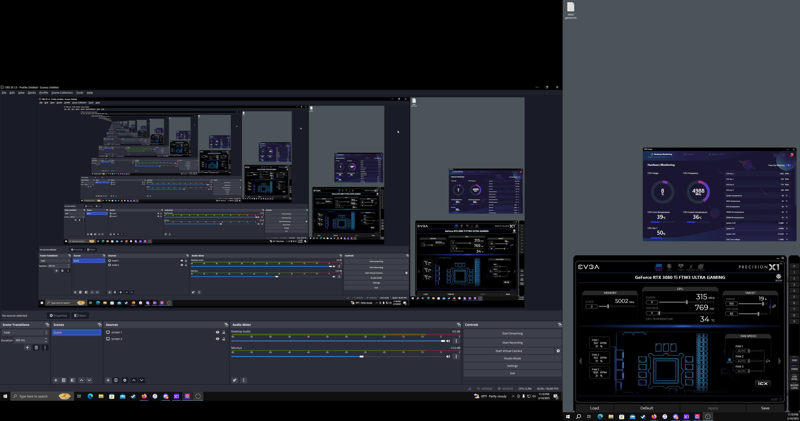
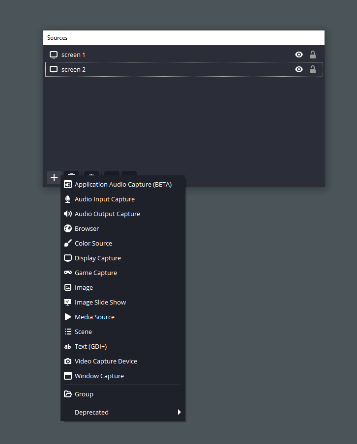
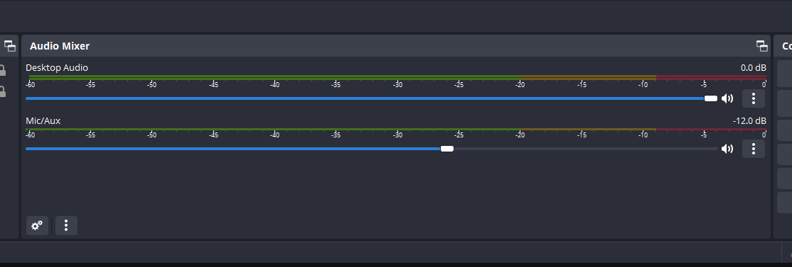
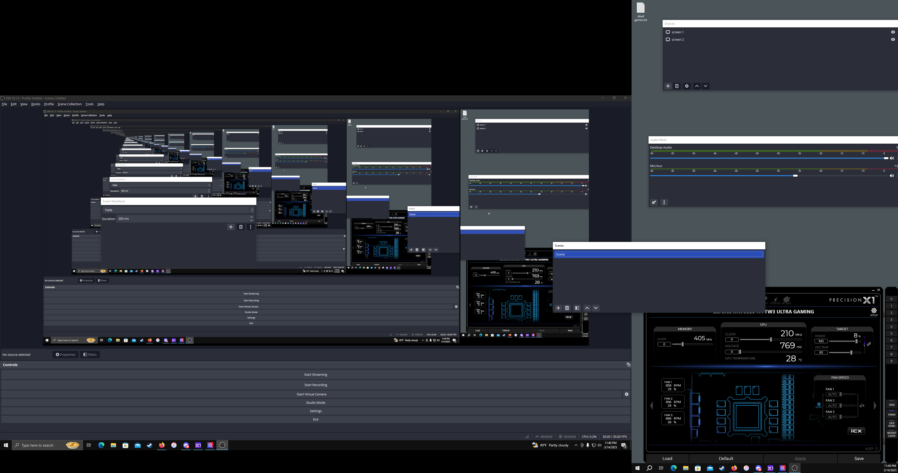

# OBS Studio: What Even *is* Any of This
Tyler Wenke, 3/14/25

Playing video games with friends is fun, but do you know what's even more fun? Recording games to later show your friends all the horrible plays they made. For this I typically use OBS Studio, a free screen recording utility. Unfortunately while recording a computer screen should be a simple task OBS Studio has many options that overwhelm new users and make it harder for users to take even simple recordings.
The first issue a new user runs into is setup. OBS Studio doesn't have a simple way to auto detect device settings and setup recording settings accordingly, as a result the user is dropped in front of a screen that looks something like this (mine has already been set up so it looks a bit different)

Setup takes the user through a long list of settings, New users will need to specify a; recording device, audio device, file save location, and video quality preset before the application will allow the user to begin recording. There is no built in tutorial or explanation for any of these settings so if the user hits any snags they will need to find a source outside of the app to resolve any confusion. In my experience these *outside sources* will make sure to laugh at you for failing to understand any of the setup steps before helping. 

I have two screens so I had to make OBS Studio recognize and format both screens accordingly. This goal lead me to this daunting list of options:

Once I had convinced OBS Studio to recognize both screens

Once I had convinced OBS Studio to recognize both screens I had to get the audio mixer to balance correctly. While this isn't overwhelmingly difficult to do it has poor **feedback** which makes it difficult to tell when the audio is balanced to your liking. As far as I can tell the best way to determine if the audio is mixed correctly is to: make a recording -> play some audio and speak -> stop recording -> watch recording -> repeat until settings are correct. This can be a hassle and I wish there was a quick setup playback option available. 

Oh and did I mention you can easily *accidentally* pop windows out of the main OBS application? This could be a helpful feature to some users but it is very confusing for new users to suddenly have their one confusing application turned into several confusing applications. 

